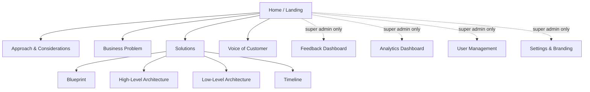

# MALKOM 3.0 MVP Planner Portal — Requirements & Planning Document

| | |
|---|---|
| **Project** | MALKOM 3.0 MVP Planner Portal |
| **Purpose** | Stakeholder-facing web portal that presents the MALKOM MVP programme (business problem, approach, solutions, timeline) and collects structured feedback from every viewer |
| **Status** | Draft v1.1 — SSO protocol, super admins, brand palette confirmed; full DB-driven CMS added to MVP scope |
| **Date** | 2026-07-28 |
| **Author** | Tushar Parik (with Claude) |

**v1.1 changes:** SAML 2.0 confirmed from iLearn reference code · Super admins: `tushar.parik@wns.com`, `u139289@wns.com` · Official brand palette (Allports #0070AD / Black / White) + logo received · **All page content is now DB-driven and authorable by Super Admins in the UI (authoring studio moved into MVP)** · Everything configurable via environment + runtime settings, nothing hardcoded.

---

## 1. Vision & Goals

### 1.1 What we are building

A single-page-application portal (with API backend) that acts as the **living planning document** for the MALKOM 3.0 MVP. Instead of circulating PowerPoints and Word docs, stakeholders open one URL and see:

- What MALKOM MVP is and where it stands today (**Home / landing page**)
- Why we are doing it (**Business Problem**)
- How we intend to do it and what we weighed up (**Approach & Considerations**)
- What we will deliver (**Solutions**: blueprint, high-level architecture, low-level architecture, timeline)
- What users/customers are saying (**Voice of Customer**)

**Every pixel of content is data.** Pages are composed of typed content blocks stored in Postgres; Super Admins create and edit all of it directly in the browser (edit mode), so the portal never needs a redeploy to change content. Every visitor — regardless of role — can leave feedback on any page, section, or individual block through a globally available floating feedback tracker. Programme leadership (Super Admins) get dashboards showing all feedback plus full per-user page analytics.

### 1.2 Goals

| # | Goal | Success measure |
|---|------|-----------------|
| G1 | One source of truth for the MALKOM MVP plan | All five nav sections populated and current |
| G2 | Frictionless stakeholder feedback | Feedback possible from any page in ≤ 3 clicks via the floating button |
| G3 | Traceable review cycle | Every feedback item has a status and an owner; nothing is lost in email |
| G4 | Leadership visibility | Super admins see per-user, per-page analytics and a consolidated feedback dashboard |
| G5 | Zero-friction access | InstaSafe SSO — no separate credentials, auto-provisioning as Viewer on first login |
| G6 | Content without code | Super Admins author/edit/publish every page's content in the UI; zero redeploys for content changes |

### 1.3 Non-goals (MVP)

- Public/anonymous access — everything sits behind InstaSafe SSO
- Real-time collaborative editing (Google-Docs-style simultaneous cursors) — single-author edit + publish workflow instead
- Mobile native apps — responsive web only
- Notification emails/Slack integration — Phase 2 candidate
- Multi-programme support — this portal serves MALKOM 3.0 only (but `Page`/`Section`/`ContentBlock` stay generic so it can be cloned for future programmes)

---

## 2. Users, Roles & RBAC

### 2.1 Roles

| Role | How assigned | Description |
|------|--------------|-------------|
| **VIEWER** | Default on first SSO login | Read every published content page; submit feedback via the floating tracker |
| **ADMIN** | Elevated by a Super Admin | Everything Viewer can do, **plus** inline "suggest a change / comment" on any individual content block (hero, card, table row, diagram, milestone, option, consideration…) |
| **SUPER_ADMIN** | Auto-elevated at first login if email ∈ `SEED_SUPER_ADMIN_EMAILS` (`tushar.parik@wns.com`, `u139289@wns.com`); further elevation via User Management | Everything Admin can do, **plus**: full content authoring studio (create/edit/reorder/publish any block on any page), approach & timeline managers, asset library, branding settings, feedback dashboard, analytics dashboard, user & role management |

### 2.2 Permission matrix

| Capability | Viewer | Admin | Super Admin |
|---|:---:|:---:|:---:|
| View all published content pages | ✅ | ✅ | ✅ |
| Submit feedback via floating tracker (any page/section/block) | ✅ | ✅ | ✅ |
| Add multiple feedback entries in one session | ✅ | ✅ | ✅ |
| View **own** submitted feedback & its status | ✅ | ✅ | ✅ |
| Inline comment / suggest edit on any content block | ❌ | ✅ | ✅ |
| See all comments on a block | ❌ | ✅ | ✅ |
| **Edit mode: create/edit/reorder/publish content blocks on every page** | ❌ | ❌ | ✅ |
| Manage approaches, options, criteria, comparison scores | ❌ | ❌ | ✅ |
| Manage timeline phases & milestones | ❌ | ❌ | ✅ |
| Upload assets (logos, diagrams, images) | ❌ | ❌ | ✅ |
| Edit runtime settings (branding, site title, feature flags) | ❌ | ❌ | ✅ |
| Preview draft (unpublished) content | ❌ | ❌ | ✅ |
| Feedback dashboard (all users' feedback, filter, change status) | ❌ | ❌ | ✅ |
| Analytics dashboard (per-page, per-user) | ❌ | ❌ | ✅ |
| Manage user roles | ❌ | ❌ | ✅ |

**Enforcement:** single source of truth on the **server** (Fastify route guards reading role from the session). The frontend only *hides* affordances; it never *authorises*.

### 2.3 Authentication — InstaSafe SSO (SAML 2.0) ✅ confirmed

**Protocol confirmed as SAML 2.0** from the existing iLearn integration (reference files: `AuthController.cs`, `SamlController.cs`, `SamlConfig.cs`). Known InstaSafe IdP details:

| Item | Value |
|---|---|
| IdP SSO URL | `https://wns.app.instasafe.io/console/idpproxy/validate/idp/<app-id>` (iLearn's app-id is `655ced7f...`; **MALKOM needs its own app registration** in the InstaSafe console) |
| IdP Entity ID | `https://wns.app.instasafe.io` |
| Single Logout URL | `https://wns.app.instasafe.io/logout` |
| AuthnRequest binding | HTTP-Redirect (unsigned in reference; keep unless InstaSafe requires signing) |
| Response binding | HTTP-POST to our ACS endpoint |
| NameID format | `urn:oasis:names:tc:SAML:1.1:nameid-format:emailAddress` — NameID **is** the user's email |
| Attributes | `email` attribute observed; presence of a display-name attribute must be verified from a real assertion (fallback: derive name from email local-part, update on first profile touch) |

**MALKOM implementation (Fastify + TypeScript):**

- **Library:** `@node-saml/node-saml` (maintained core of passport-saml) wrapped in our own Fastify auth plugin — no passport dependency.
- **Flow:** `GET /api/v1/auth/login` → generate AuthnRequest (store request ID + RelayState server-side, 5-min TTL) → 302 to InstaSafe → IdP POSTs `SAMLResponse` to `POST /api/v1/auth/callback` (ACS) → **validate** → extract NameID/attributes → **JIT-provision** `User` (role `VIEWER`, or `SUPER_ADMIN` if email ∈ `SEED_SUPER_ADMIN_EMAILS`) or update `name`/`lastSeenAt` → create Postgres session row → set HTTP-only, Secure, SameSite=Lax cookie → redirect to `/`.
- **Mandatory response validation** (all enforced, none skippable): XML signature against the InstaSafe IdP signing certificate (from IdP metadata — must be obtained at registration), audience = our SP Entity ID, `InResponseTo` matches an outstanding request ID (replay protection), `NotBefore`/`NotOnOrAfter` with ≤ 2-min clock skew, destination = our ACS URL.
- **Identity comes from the validated assertion only** — never from anything the browser sent earlier (see ⚠️ below).
- **SP registration to request from the InstaSafe admin:** SP Entity ID `https://<malkom-domain>/saml/metadata`, ACS URL `https://<malkom-domain>/api/v1/auth/callback`, and the IdP signing certificate. We expose `GET /api/v1/auth/metadata` (SP metadata XML) to make their side easy.
- **All SAML endpoints/certs/IDs come from environment variables** (§8.1) — nothing hardcoded, unlike the reference's committed `SamlConfig.cs`.
- **Logout:** revoke session row + clear cookie; then redirect to the InstaSafe SLO URL.
- **Dev/test:** a fake SAML IdP (dev-only route group, hard-disabled unless `NODE_ENV=development`) issues signed assertions with a throwaway cert so all local/E2E work runs without InstaSafe.
- **Failure handling:** friendly error page with retry; assertion details logged server-side only (never echoed to the client).

> ⚠️ **Anti-patterns in the reference implementation we will NOT replicate** (worth fixing in iLearn too):
> 1. **Signature validation is bypassed** — `CertificateValidationMode.None`, empty signing cert, and `InvalidSignatureException` is caught and ignored ("for development"). Anyone who can POST XML to the ACS can forge a login.
> 2. **Logged-in identity is taken from the pre-login session (`PendingUserId`), not from the SAML assertion** — whoever the browser *claimed* to be before SSO is who gets signed in, regardless of who actually authenticated at the IdP.
> 3. `AudienceRestricted = false` and no `InResponseTo`/replay checking.
> 4. Hardcoded fallback JWT secret in source (`"your-super-secret-key-here..."`).
> 5. A password-less form login path (`POST Login` signs users in by username alone).
> 6. The pre-SSO `CheckUser` endpoint enables user enumeration; JIT provisioning removes the need for any pre-login user lookup.

---

## 3. Information Architecture & Pages

### 3.1 Sitemap



Top navigation: **Home · Approach & Considerations · Business Problem · Solutions · Voice of Customer** — plus an avatar menu (profile, role badge, admin links when authorised, logout). Solutions uses a sub-nav (tabs): Blueprint / High-Level Architecture / Low-Level Architecture / Timeline. Super Admins additionally see a persistent **"Edit mode"** toggle in the header (§5.6).

### 3.2 Page specifications

Every page below renders entirely from DB content blocks (§5). "Spec" here means the *seeded default composition* — Super Admins can restructure any page in edit mode.

#### P1 — Home (landing page)
- **Hero band:** MALKOM 3.0 title, one-line mission, current phase badge (HERO block)
- **KPI strip:** live computed numbers — approaches evaluated, feedback received/resolved, customer voices, days to next milestone (KPI_STRIP block; metrics are computed server-side, the block only chooses which to show)
- **Section digests:** one card per nav section, auto-fed from each `Page.summary` + editable extras (CARD grid)
- **What's happening now:** recent updates feed (latest published content changes + resolved feedback) — computed, not authored

#### P2 — Approach & Considerations
- Intro (RICH_TEXT), then one **APPROACH_EMBED block per approach**. Each approach renders: context, options with pros/cons/effort/risk, the auto-generated **comparison matrix** (criteria × options), recommended option highlight, and considerations. All rows/options are individually addressable for comments/feedback.

#### P3 — Business Problem
- Problem statements (PROBLEM_STATEMENT blocks: title, narrative, impact, severity, stakeholders), pain-point grid, cost-of-doing-nothing narrative, MVP success criteria list.

#### P4 — Solutions (tabbed)
- **Blueprint:** BLUEPRINT_BLOCK grid (capability blocks by layer) + narrative
- **High-Level / Low-Level Architecture:** DIAGRAM blocks (Mermaid source or uploaded SVG/PNG asset) + component DATA_TABLE / narrative blocks
- **Timeline:** TIMELINE_EMBED block rendering phases → milestones from the timeline tables (§5.2); each milestone addressable

#### P5 — Voice of Customer
- THEME_GROUP blocks (theme + implication), each containing QUOTE blocks (verbatim, persona, sentiment); optional stat tiles

#### P6 — Feedback Dashboard (SUPER_ADMIN)
- Table of all feedback: filters by page, section, type, status, user, date; status workflow `OPEN → UNDER_REVIEW → ACCEPTED / REJECTED → RESOLVED` with internal note; counts by page/type/status; CSV export

#### P7 — Analytics Dashboard (SUPER_ADMIN)
- Portal totals (unique users, sessions, page views, avg session duration); per-page views/unique viewers/avg dwell/feedback generated; **per-user drill-down** (pages visited, time per page, visit timeline, feedback submitted); trend charts

#### P8 — User Management (SUPER_ADMIN)
- User list from SSO provisioning: role dropdown, last-seen, feedback count

#### P9 — Settings & Branding (SUPER_ADMIN)
- Site title, footer notice, brand colors (defaults = official palette), logo (asset picker), feature flags (inline comments on/off, analytics notice text) — all stored in `AppSetting`, applied at runtime without redeploy (§7.2)

---

## 4. The Feedback System

### 4.1 Global floating feedback tracker

A **floating action button (FAB)**, bottom-right, visible on every page for every authenticated role. Opens a **Sheet/Drawer** (shadcn `Sheet`) with:

1. **Target selector (cascading dropdowns, pre-filled from current context):** *Page* (defaults to current) → *Section* (optional, "General" default) → *Block/Item* (optional)
2. **Feedback type:** `GENERAL` · `SUGGESTION` · `EDIT_PROPOSAL` · `QUESTION` · `CONCERN`
3. **Message** (required, 10–2000 chars) + optional proposed text for `EDIT_PROPOSAL`
4. **"Add another"** — queue **multiple feedback entries** in one drawer session, submit as a batch
5. **My feedback tab** — previous submissions with live status badges

### 4.2 Inline block comments (Admin +)

- Hovering any content block shows a subtle comment affordance (Material `comment` icon)
- Opens a `Popover`/`Dialog` thread anchored to that block: comment list + composer
- One-level threading (comment → replies), visible to Admins and Super Admins
- Same polymorphic target mechanism as feedback (`entityType` + `entityId`)

### 4.3 Feedback lifecycle

```
User submits ──► OPEN ──► UNDER_REVIEW ──► ACCEPTED ──► RESOLVED
                                    └────► REJECTED (with reason)
```

- Only Super Admins change status; submitters always see the current status of their own items
- Status changes append to `FeedbackActivity` (audit: who, when, from→to, note)
- An ACCEPTED `EDIT_PROPOSAL` is applied **manually** by a Super Admin in edit mode (one click from the feedback item to the target block's editor) — no auto-apply in MVP

---

## 5. Data Model — fully DB-driven content

### 5.1 Design principles

1. **Block-based content backbone.** `Page → Section → ContentBlock` where a block has a `kind` and a kind-specific JSON `payload` validated by a shared Zod schema. Blocks self-nest one level (`parentId`) so grids/groups (stat grids, card grids, VoC themes) have individually addressable children. This one table drives *every* visual element on every page — and gives the authoring UI a single uniform CRUD surface.
2. **Typed domain tables where structure earns its keep.** Approaches (options × criteria matrix) and the delivery timeline (phases → milestones) get real relational tables because they need generated rows, cross-column logic, and dedicated editors — then embed into pages via `APPROACH_EMBED` / `TIMELINE_EMBED` blocks.
3. **Everything commentable is a row.** Feedback/comments target (`entityType`, `entityId`) validated server-side; blocks, approaches, options, scores, considerations, phases, and milestones are all rows, so "comment on any item" needs no mirroring.
4. **Draft → publish.** Blocks carry a status; viewers see `PUBLISHED` only, Super Admins can preview drafts. Every edit snapshots the previous payload into `ContentRevision` (audit + one-click revert).
5. **Runtime configuration in `AppSetting`,** secrets/infra in environment (§8.1). Append-only `AnalyticsEvent` and `AuditLog` for observability and governance.

### 5.2 Prisma schema (full)

```prisma
// ---------- Enums ----------
enum Role            { VIEWER ADMIN SUPER_ADMIN }
enum BlockStatus     { DRAFT PUBLISHED ARCHIVED }
enum BlockKind {
  HERO RICH_TEXT KPI_STRIP GRID_GROUP STAT CARD LIST_ITEM
  QUOTE THEME_GROUP PROBLEM_STATEMENT BLUEPRINT_BLOCK
  DIAGRAM IMAGE DATA_TABLE CTA
  APPROACH_EMBED TIMELINE_EMBED
}
enum FeedbackType    { GENERAL SUGGESTION EDIT_PROPOSAL QUESTION CONCERN }
enum FeedbackStatus  { OPEN UNDER_REVIEW ACCEPTED REJECTED RESOLVED }
enum EntityType {
  PAGE SECTION CONTENT_BLOCK
  APPROACH APPROACH_OPTION CRITERION CRITERION_SCORE CONSIDERATION
  TIMELINE_PHASE TIMELINE_MILESTONE
}
enum PhaseStatus     { PLANNED IN_PROGRESS DONE AT_RISK }
enum MilestoneStatus { PLANNED IN_PROGRESS DONE AT_RISK SLIPPED }
enum EventType       { PAGE_VIEW PAGE_EXIT SECTION_VIEW FEEDBACK_OPEN FEEDBACK_SUBMIT NAV_CLICK }

// ---------- Auth & Users ----------
model User {
  id         String    @id @default(cuid())
  ssoUserId  String    @unique          // SAML NameID (email)
  email      String    @unique
  name       String
  role       Role      @default(VIEWER)
  createdAt  DateTime  @default(now())
  lastSeenAt DateTime?
  sessions   Session[]
  feedback   Feedback[]
  comments   Comment[]
  events     AnalyticsEvent[]
  revisions  ContentRevision[]
  assets     Asset[]
  auditLogs  AuditLog[]
}

model Session {
  id        String    @id @default(cuid())
  userId    String
  user      User      @relation(fields: [userId], references: [id])
  createdAt DateTime  @default(now())
  expiresAt DateTime
  revokedAt DateTime?
  userAgent String?
  @@index([userId, expiresAt])
}

// ---------- Runtime configuration & assets ----------
model AppSetting {
  key         String   @id      // brand.primaryColor, brand.logoAssetId, site.title, site.footerNotice, feature.inlineComments, ...
  value       Json
  updatedById String?
  updatedAt   DateTime @updatedAt
}

model Asset {
  id           String   @id @default(cuid())
  fileName     String
  mimeType     String   // image/svg+xml, image/png, image/jpeg
  bytes        Int
  storagePath  String   // relative to UPLOADS_DIR volume
  alt          String?
  uploadedById String
  uploadedBy   User     @relation(fields: [uploadedById], references: [id])
  createdAt    DateTime @default(now())
}

// ---------- Content backbone ----------
model Page {
  id        String    @id @default(cuid())
  slug      String    @unique   // home | approach | business-problem | solutions | voice-of-customer
  title     String
  summary   String              // powers Home digests
  order     Int
  updatedAt DateTime  @updatedAt
  sections  Section[]
}

model Section {
  id          String         @id @default(cuid())
  pageId      String
  page        Page           @relation(fields: [pageId], references: [id])
  slug        String         // for Solutions this includes the tab: blueprint | hld | lld | timeline
  title       String
  description String?
  order       Int
  blocks      ContentBlock[]
  @@unique([pageId, slug])
}

model ContentBlock {
  id          String            @id @default(cuid())
  sectionId   String
  section     Section           @relation(fields: [sectionId], references: [id])
  parentId    String?           // one-level nesting: GRID_GROUP/THEME_GROUP children
  parent      ContentBlock?     @relation("BlockChildren", fields: [parentId], references: [id])
  children    ContentBlock[]    @relation("BlockChildren")
  kind        BlockKind
  payload     Json              // kind-specific, Zod-validated at the API boundary (§5.3)
  order       Int
  status      BlockStatus       @default(DRAFT)
  createdById String
  updatedById String?
  publishedAt DateTime?
  createdAt   DateTime          @default(now())
  updatedAt   DateTime          @updatedAt
  revisions   ContentRevision[]
  @@index([sectionId, status, order])
}

model ContentRevision {
  id         String       @id @default(cuid())
  blockId    String
  block      ContentBlock @relation(fields: [blockId], references: [id])
  kind       BlockKind
  payload    Json         // snapshot BEFORE the edit
  status     BlockStatus
  editedById String
  editedBy   User         @relation(fields: [editedById], references: [id])
  note       String?
  createdAt  DateTime     @default(now())
  @@index([blockId, createdAt])
}

// ---------- Approach engine ----------
model Approach {
  id                  String           @id @default(cuid())
  title               String
  context             String
  recommendedOptionId String?
  rationale           String?          // why the recommended option
  order               Int
  updatedAt           DateTime         @updatedAt
  options             ApproachOption[]
  considerations      Consideration[]
  criteria            Criterion[]
}

model ApproachOption {
  id             String           @id @default(cuid())
  approachId     String
  approach       Approach         @relation(fields: [approachId], references: [id])
  title          String
  description    String
  pros           String[]
  cons           String[]
  effort         Int?             // 1..5
  risk           Int?             // 1..5
  order          Int
  scores         CriterionScore[]
  considerations Consideration[]
}

model Criterion {
  id         String           @id @default(cuid())
  approachId String
  approach   Approach         @relation(fields: [approachId], references: [id])
  label      String           // Cost, Time-to-market, Scalability, ...
  weight     Int              @default(1)
  order      Int
  scores     CriterionScore[]
}

// auto-generated in background for every option × criterion pair (§5.5)
model CriterionScore {
  id          String         @id @default(cuid())
  criterionId String
  criterion   Criterion      @relation(fields: [criterionId], references: [id])
  optionId    String
  option      ApproachOption @relation(fields: [optionId], references: [id])
  score       Int?           // null = "to be assessed"
  note        String?
  @@unique([criterionId, optionId])
}

model Consideration {
  id         String          @id @default(cuid())
  approachId String
  approach   Approach        @relation(fields: [approachId], references: [id])
  optionId   String?         // null = applies to whole approach
  option     ApproachOption? @relation(fields: [optionId], references: [id])
  kind       String          // CONSTRAINT | DEPENDENCY | ASSUMPTION | RISK
  text       String
  order      Int
}

// ---------- Timeline ----------
model TimelinePhase {
  id          String              @id @default(cuid())
  title       String
  description String?
  startDate   DateTime
  endDate     DateTime
  status      PhaseStatus         @default(PLANNED)
  order       Int
  milestones  TimelineMilestone[]
}

model TimelineMilestone {
  id          String          @id @default(cuid())
  phaseId     String
  phase       TimelinePhase   @relation(fields: [phaseId], references: [id])
  title       String
  description String?
  dueDate     DateTime
  status      MilestoneStatus @default(PLANNED)
  order       Int
}

// ---------- Feedback & comments ----------
model Feedback {
  id           String             @id @default(cuid())
  userId       String
  user         User               @relation(fields: [userId], references: [id])
  entityType   EntityType
  entityId     String
  type         FeedbackType
  message      String
  proposedText String?            // for EDIT_PROPOSAL
  status       FeedbackStatus     @default(OPEN)
  createdAt    DateTime           @default(now())
  activity     FeedbackActivity[]
  @@index([entityType, entityId])
  @@index([status, createdAt])
}

model FeedbackActivity {
  id         String         @id @default(cuid())
  feedbackId String
  feedback   Feedback       @relation(fields: [feedbackId], references: [id])
  actorId    String
  fromStatus FeedbackStatus
  toStatus   FeedbackStatus
  note       String?
  createdAt  DateTime       @default(now())
}

model Comment {
  id         String     @id @default(cuid())
  userId     String
  user       User       @relation(fields: [userId], references: [id])
  entityType EntityType
  entityId   String
  parentId   String?
  parent     Comment?   @relation("Thread", fields: [parentId], references: [id])
  replies    Comment[]  @relation("Thread")
  body       String
  createdAt  DateTime   @default(now())
  @@index([entityType, entityId])
}

// ---------- Analytics & audit ----------
model AnalyticsEvent {
  id          String    @id @default(cuid())
  userId      String
  user        User      @relation(fields: [userId], references: [id])
  sessionId   String
  type        EventType
  pageSlug    String
  sectionSlug String?
  durationMs  Int?      // PAGE_EXIT / SECTION_VIEW dwell time
  meta        Json?
  createdAt   DateTime  @default(now())
  @@index([userId, createdAt])
  @@index([pageSlug, type, createdAt])
}

model AuditLog {
  id         String     @id @default(cuid())
  actorId    String
  actor      User       @relation(fields: [actorId], references: [id])
  action     String     // ROLE_CHANGED | BLOCK_PUBLISHED | BLOCK_REVERTED | SETTING_UPDATED | ASSET_UPLOADED | ...
  entityType EntityType?
  entityId   String?
  meta       Json?
  createdAt  DateTime   @default(now())
  @@index([actorId, createdAt])
}
```

### 5.3 Block payload registry (shared Zod schemas)

Each `BlockKind` has one Zod schema in `packages/shared` — used by the API to validate writes, and by the web app to type renderers and generate editor forms. One registry object drives everything:

| Kind | Payload shape | Children |
|---|---|---|
| `HERO` | `{ title, subtitle?, badge?, backgroundAssetId? }` | — |
| `RICH_TEXT` | `{ markdown }` (rendered via react-markdown + remark-gfm, sanitized) | — |
| `KPI_STRIP` | `{ metrics: [{ key, label? }] }` — keys resolve to server-computed values (`approaches.count`, `feedback.open`, `feedback.resolved`, `voices.count`, `milestone.next.days`) | — |
| `GRID_GROUP` | `{ title?, columns: 2\|3\|4 }` | `STAT` \| `CARD` \| `BLUEPRINT_BLOCK` \| `LIST_ITEM` |
| `STAT` | `{ label, value, icon?, trend? }` | — |
| `CARD` | `{ title, body, icon?, href? }` | — |
| `LIST_ITEM` | `{ text, icon? }` | — |
| `THEME_GROUP` | `{ title, implication }` (VoC theme) | `QUOTE` |
| `QUOTE` | `{ text, personaName, personaRole?, sentiment: POSITIVE\|NEUTRAL\|NEGATIVE }` | — |
| `PROBLEM_STATEMENT` | `{ title, narrative, impact, severity: 1..5, stakeholders: string[] }` | — |
| `BLUEPRINT_BLOCK` | `{ title, description, layer, icon? }` | — |
| `DIAGRAM` | `{ source: 'MERMAID'\|'ASSET', mermaid?, assetId?, caption? }` | — |
| `IMAGE` | `{ assetId, alt, caption? }` | — |
| `DATA_TABLE` | `{ columns: string[], rows: string[][] , caption? }` (feedback targets the table as one block) | — |
| `CTA` | `{ label, href, variant }` | — |
| `APPROACH_EMBED` | `{ approachId }` — renders the full approach (options, matrix, considerations) from relational tables | — |
| `TIMELINE_EMBED` | `{ }` — renders all timeline phases/milestones | — |

`icon` fields hold a **Material Symbols** name, picked via an icon-picker in the editor.

### 5.4 Page → schema composition map

How each nav page is driven, end to end:

| Page | Sections (seeded) | Driven by |
|---|---|---|
| Home | hero, kpis, digests, updates | HERO · KPI_STRIP (computed) · GRID_GROUP+CARD (digest cards auto-fed from `Page.summary`) · computed updates feed (latest `ContentRevision` publishes + RESOLVED feedback) |
| Approach & Considerations | intro, one per approach | RICH_TEXT · APPROACH_EMBED → `Approach`/`ApproachOption`/`Criterion`/`CriterionScore`/`Consideration` |
| Business Problem | problems, pain-points, cost-of-nothing, success-criteria | PROBLEM_STATEMENT · GRID_GROUP+STAT · RICH_TEXT · LIST_ITEMs |
| Solutions / Blueprint | blueprint | GRID_GROUP+BLUEPRINT_BLOCK · RICH_TEXT |
| Solutions / HLD, LLD | diagrams, components | DIAGRAM (Mermaid or Asset) · DATA_TABLE · RICH_TEXT |
| Solutions / Timeline | timeline | TIMELINE_EMBED → `TimelinePhase`/`TimelineMilestone` |
| Voice of Customer | themes, stats | THEME_GROUP+QUOTE · GRID_GROUP+STAT |

`GET /pages/:slug` returns the section list with nested published block trees (drafts included only for Super Admin preview), plus resolved embeds (approach data, timeline data, computed KPI values) in one response — the frontend renders via a `BlockRenderer` registry (`kind → React component`).

### 5.5 Background generation ("approach-based tables")

When a Super Admin creates/updates an Approach, its options, or its criteria, the API enqueues an in-process background job (`p-queue`; no Redis at this scale) that:

1. Generates a `CriterionScore` row for **every option × criterion pair** that doesn't exist yet (score `null` = "to be assessed") — the comparison matrix always renders complete, and every cell is immediately a feedback/comment target.
2. Prunes orphaned scores when an option/criterion is deleted.
3. Invalidates the cached KPI metric values used by `KPI_STRIP` blocks.

### 5.6 Content Authoring Studio (Super Admin)

Not a separate CMS — **editing happens on the real pages**:

- **Edit-mode toggle** in the header (Super Admin only). When on, each section/block shows: *add block* (palette of kinds valid in that position), *edit* (opens kind-specific form), *drag handle* (reorder via dnd-kit), *archive*, *status chip* (Draft/Published).
- **Kind-specific editor forms** auto-shaped by the Zod registry: markdown textarea with live preview (RICH_TEXT), Mermaid editor with live render (DIAGRAM), Material icon picker (STAT/CARD/…), asset picker with upload (IMAGE/DIAGRAM/HERO).
- **Publish workflow:** save = new draft revision; *Publish* makes it live (`publishedAt` set, revision snapshotted); *Revert* restores any prior `ContentRevision`. Unpublished-changes badge on the edit toggle.
- **Dedicated managers** (structured editors, reachable from edit mode): **Approach Manager** (approaches → options → criteria → score matrix inline editing; matrix cells auto-created by §5.5) and **Timeline Manager** (phases → milestones with dates/status).
- **Asset library:** upload SVG/PNG/JPEG (size-limited, MIME-sniffed server-side, served with safe `Content-Type` and `Content-Disposition` — SVGs sanitized), browse, pick.
- **Page/section management:** edit page titles/summaries; add/rename/reorder sections within the five fixed pages (pages themselves are fixed in MVP — nav stability).
- All mutations write `AuditLog` entries.

### 5.7 Seeding & provisioning

- `prisma/seed.ts` creates the 5 pages, default sections, and starter blocks from versioned JSON files in `content/seed/` (content changes reviewable in PRs; DB reproducible).
- `SEED_SUPER_ADMIN_EMAILS=tushar.parik@wns.com,u139289@wns.com` — JIT provisioning grants `SUPER_ADMIN` to these emails on first login (and seed marks them if pre-created).
- Brand defaults seeded into `AppSetting` (§7.2); the provided logo file is seeded as the first `Asset` (drop the original SVG/PNG into `content/brand/` at scaffold time — the chat-pasted image isn't on disk).

---

## 6. API Design (Fastify, REST, `/api/v1`)

All responses use the standard envelope:

```json
{ "success": true, "data": { }, "error": null, "meta": { "total": 0, "page": 1, "limit": 20 } }
```

Validation: **Zod** schemas at every boundary (shared package). Errors: stable codes, user-safe messages, detailed server-side logs (pino, request-id).

### Public (any authenticated role)

| Method & path | Purpose |
|---|---|
| `GET  /auth/login` | Build SAML AuthnRequest → redirect to InstaSafe IdP |
| `POST /auth/callback` | SAML ACS: validate assertion → JIT provision → set session cookie |
| `GET  /auth/metadata` | SP metadata XML (for InstaSafe app registration) |
| `POST /auth/logout` | Revoke session |
| `GET  /auth/me` | Current user + role (bootstraps the SPA) |
| `GET  /settings/public` | Runtime branding/config for theme bootstrap (colors, logo URL, site title, flags) |
| `GET  /pages` | Nav + page summaries (Home digests) |
| `GET  /pages/:slug` | Sections + published block trees + resolved embeds/KPIs (`?preview=1` includes drafts, SUPER_ADMIN only) |
| `GET  /assets/:id` | Serve asset file (auth-gated, cache headers) |
| `GET  /feedback/targets?page=…` | Cascading dropdown data (sections/blocks for a page) |
| `POST /feedback` | Submit one or a **batch** of feedback entries |
| `GET  /feedback/mine` | Own feedback + statuses |
| `POST /analytics/events` | Batch event ingest (accepts `sendBeacon`) |

### Admin (ADMIN +)

| Method & path | Purpose |
|---|---|
| `GET  /comments?entityType=&entityId=` | Thread for a block/item |
| `POST /comments` | Add comment/reply |

### Super Admin

| Method & path | Purpose |
|---|---|
| `PATCH /admin/pages/:id` | Title/summary |
| `POST/PATCH/DELETE /admin/sections` (+`/reorder`) | Section CRUD within a page |
| `POST/PATCH/DELETE /admin/blocks` (+`/reorder`) | Block CRUD (payload Zod-validated per kind) |
| `POST /admin/blocks/:id/publish` · `/revert/:revisionId` | Publish workflow |
| `GET  /admin/blocks/:id/revisions` | Revision history |
| `POST/PATCH/DELETE /admin/approaches` (+ nested `/options` `/criteria`, `PATCH /scores/:id`) | Approach engine (triggers §5.5 job) |
| `POST/PATCH/DELETE /admin/timeline/phases` (+ `/milestones`) | Timeline manager |
| `POST /admin/assets` (multipart) · `GET /admin/assets` · `DELETE /admin/assets/:id` | Asset library |
| `GET/PATCH /admin/settings` | Runtime settings (branding, flags) |
| `GET  /admin/feedback` · `PATCH /admin/feedback/:id/status` | Feedback dashboard + workflow |
| `GET  /admin/analytics/summary` · `/users` · `/users/:id` | Analytics dashboards |
| `GET  /admin/users` · `PATCH /admin/users/:id/role` | User management |
| `GET  /admin/audit` | Audit log |

**Cross-cutting:** `@fastify/helmet`, `@fastify/rate-limit` (global + stricter on `POST /feedback` and `/admin/assets`), `@fastify/cors` (same-origin in prod), CSRF via SameSite=Lax cookie + Origin-header check on mutating routes, `@fastify/multipart` with size/MIME limits for uploads.

---

## 7. Frontend Architecture

### 7.1 Stack

| Concern | Choice |
|---|---|
| Framework | **React 18 + TypeScript + Vite** (SPA) |
| Routing | React Router v6 (`/`, `/approach`, `/business-problem`, `/solutions/:tab`, `/voice-of-customer`, `/admin/*`) |
| UI kit | **shadcn/ui** on **Radix primitives** |
| Styling | **Tailwind CSS** with runtime CSS-variable theme (§7.2) |
| Icons | **Google Material Symbols** (self-hosted `material-symbols` npm package — no CDN) |
| Server state | TanStack Query (caching, optimistic feedback submission) |
| Drag & drop | dnd-kit (edit-mode reordering) |
| Markdown | react-markdown + remark-gfm (sanitized; no raw HTML) |
| Charts (analytics) | Recharts |
| Diagrams | Mermaid (lazy-loaded, client-rendered from stored source) + asset (SVG/PNG) fallback |
| Forms/validation | react-hook-form + shared Zod schemas |

### 7.2 Theme — official Capgemini palette, runtime-configurable

**Brand palette (confirmed):**

| Token | Default | Source |
|---|---|---|
| `--brand-primary` | `#0070AD` **Allports** | Official Capgemini brand color |
| `--brand-black` | `#000000` | Official |
| `--brand-white` | `#FFFFFF` | Official |
| `--brand-primary-hover` | `#005A8C` | Derived tint of Allports |
| `--brand-primary-soft` | `#E6F1F7` | Derived tint (soft surfaces, active nav) |
| Status colors (success/warn/danger) | standard UI greens/ambers/reds | Functional, non-brand |
| Font | **Ubuntu** (self-hosted woff2) | Capgemini brand typeface |

**Implementation:** shadcn's CSS-variable convention — Tailwind color utilities reference `var(--…)`. On app bootstrap, `GET /settings/public` returns the active brand values from `AppSetting` (seeded with the defaults above) and injects them as CSS variables. **Result: Super Admins can adjust branding from the Settings page at runtime — no rebuild, nothing hardcoded.**

**Logo:** the provided Capgemini spade mark. Original file (SVG preferred) to be dropped into `content/brand/` at scaffold time → seeded as an `Asset` → referenced by `AppSetting brand.logoAssetId` → swappable from Settings.

### 7.3 Component inventory

shadcn: `navigation-menu`, `card`, `tabs`, `accordion`, `table`, `badge`, `avatar`, `dropdown-menu`, `select`, `sheet`, `dialog`, `popover`, `textarea`, `button`, `tooltip`, `sonner`, `separator`, `scroll-area`, `switch`, chart wrappers.

Custom (render): `BlockRenderer` (kind → component registry), `ApproachCard` + `ComparisonMatrix`, `TimelineRail`, `MermaidDiagram`, `StatTile`, `QuoteCard`, `KpiStrip`, `RagBadge`, `RoleGate`, `AnalyticsTracker`.

Custom (feedback): `FeedbackFab`, `FeedbackDrawer` (cascading targets + batch list), `CommentAnchor`/`CommentThread`.

Custom (authoring): `EditModeProvider` + header toggle, `BlockToolbar` (edit/reorder/archive/status), `BlockEditorDialog` (Zod-driven forms per kind), `MarkdownEditor` (textarea + live preview), `MermaidEditor`, `IconPicker` (Material Symbols search), `AssetPicker`/`AssetUploader`, `ApproachManager`, `TimelineManager`, `RevisionHistory`.

### 7.4 Analytics instrumentation (client)

- `PAGE_VIEW` on route enter; `PAGE_EXIT` with `durationMs` on route leave / `visibilitychange` / `pagehide` (via `sendBeacon`)
- `SECTION_VIEW` via IntersectionObserver (≥ 50 % visible for ≥ 2 s)
- `FEEDBACK_OPEN` / `FEEDBACK_SUBMIT`, `NAV_CLICK`
- Buffered client-side, flushed in batches (5 s / 10 events / on exit) to `POST /analytics/events`

---

## 8. Repository Layout & Configuration

```
malkom_3o_planner/
├── PLANNING.md
├── package.json                 ← pnpm workspace root
├── docker-compose.yml           ← postgres (dev) / full stack (prod)
├── .env.example                 ← every variable documented, no real values
├── apps/
│   ├── web/                     ← React + Vite SPA
│   │   └── src/
│   │       ├── app/             ← router, providers, layout shell, theme bootstrap
│   │       ├── features/        ← home/ approach/ problem/ solutions/ voc/ feedback/ comments/ analytics/ authoring/ admin/
│   │       ├── components/ui/   ← shadcn
│   │       ├── components/shared/
│   │       ├── blocks/          ← BlockRenderer registry + one component per BlockKind
│   │       └── lib/             ← api client, query hooks, utils
│   └── api/                     ← Fastify + TypeScript
│       ├── src/
│       │   ├── config/          ← Zod-validated env loader (fail-fast at startup)
│       │   ├── plugins/         ← auth(saml), session, rbac, rate-limit, multipart, error-handler
│       │   ├── modules/         ← auth/ pages/ blocks/ approaches/ timeline/ feedback/ comments/ analytics/ assets/ settings/ admin/
│       │   │   └── <mod>/{routes,service,repository,schemas}.ts
│       │   ├── jobs/            ← score-matrix generation, KPI cache
│       │   └── server.ts
│       └── prisma/              ← schema.prisma, migrations, seed.ts
├── packages/
│   └── shared/                  ← Zod block-payload registry, API types, role/permission constants, settings keys
├── content/
│   ├── seed/                    ← versioned starter content (JSON)
│   └── brand/                   ← logo source files (drop provided SVG/PNG here)
└── uploads/                     ← runtime asset volume (gitignored, docker volume in prod)
```

Conventions: immutable data patterns, files ≤ 400 lines (800 hard max), functions < 50 lines, repository pattern, no hardcoded values — constants/config only.

### 8.1 Configuration strategy — environment vs runtime settings

**Environment (`.env`, Zod-validated at startup — process exits with a clear message if anything required is missing):**

| Variable | Purpose |
|---|---|
| `DATABASE_URL` | Postgres connection |
| `APP_BASE_URL` | Public URL; ACS/metadata URLs derived from it |
| `PORT`, `NODE_ENV`, `LOG_LEVEL` | Runtime basics |
| `SESSION_SECRET` | Cookie signing (≥ 32 chars, generated per environment) |
| `SESSION_TTL_HOURS` | Session lifetime |
| `SAML_IDP_SSO_URL` | InstaSafe IdP SSO URL (with MALKOM app-id) |
| `SAML_IDP_ENTITY_ID` | `https://wns.app.instasafe.io` |
| `SAML_IDP_CERT` | IdP signing certificate (base64 PEM) — **required in production** |
| `SAML_SP_ENTITY_ID` | Our SP entity ID |
| `SAML_SLO_URL` | InstaSafe logout URL |
| `SEED_SUPER_ADMIN_EMAILS` | `tushar.parik@wns.com,u139289@wns.com` |
| `UPLOADS_DIR`, `MAX_UPLOAD_MB` | Asset storage |
| `RATE_LIMIT_WINDOW_MS`, `RATE_LIMIT_MAX` | Throttling |

**Runtime settings (`AppSetting` table, editable in the UI, no redeploy):** brand colors, logo, site title, footer/analytics notice text, feature flags (inline comments on/off), KPI strip metric availability.

**Rule:** secrets and infrastructure → environment; anything a Super Admin may want to change → `AppSetting`. Nothing in source code.

---

## 9. Non-Functional Requirements

| Area | Requirement |
|---|---|
| Performance | FCP < 2 s on office network; API p95 < 300 ms; `GET /pages/:slug` resolves blocks + embeds in one round trip; analytics ingest fire-and-forget |
| Accessibility | WCAG 2.1 AA; full keyboard support; icons always paired with labels/aria |
| Responsive | Desktop-first, usable down to 768 px; FAB/drawer mobile-friendly |
| Browser support | Evergreen Chrome/Edge (corporate standard) |
| Security | §6 cross-cutting + checklist per commit: no secrets in code, Zod validation at boundaries, Prisma parameterisation, sanitized markdown (no raw HTML), sanitized SVG uploads, RBAC enforced server-side, rate limits, strict SAML validation (§2.3) |
| Privacy | Per-identified-user analytics disclosed via footer notice (text editable in Settings); no third-party trackers |
| Auditability | `ContentRevision` for every edit, `FeedbackActivity` for workflow, `AuditLog` for role/settings/publish actions |
| Backup | Nightly `pg_dump` + uploads volume backup on VPS; schema changes via `prisma migrate` only |

---

## 10. Testing Strategy (TDD, ≥ 80 % coverage)

| Layer | Tooling | Focus |
|---|---|---|
| Unit | Vitest | Block payload Zod registry (valid/invalid per kind), RBAC guards, feedback state machine, score-matrix generator, KPI resolvers, analytics aggregators |
| API integration | Vitest + `fastify.inject()` + Testcontainers Postgres | Every endpoint: happy path + authz failures (viewer→admin routes, admin→super-admin routes) + validation failures + SAML rejection cases (bad signature, replay, wrong audience) + publish/revert flows |
| Frontend | Vitest + React Testing Library | BlockRenderer per kind, FeedbackDrawer batch flow, edit-mode toolbar, editor forms, RoleGate |
| E2E | Playwright + fake IdP | Login → browse all pages → submit batch feedback → admin comments a block → super admin edits & publishes a block → resolves feedback → dashboards render |

---

## 11. Delivery Plan

| Phase | Days | Scope | Exit gate |
|---|---|---|---|
| **0 — Foundation** | 1–2 | pnpm monorepo, Vite+Tailwind+shadcn+theme bootstrap, Fastify+Prisma+Postgres (docker-compose), shared package, Zod env loader, CI (lint/test/build) | Hello-world SPA served; `/auth/me` 401s cleanly; schema migrates |
| **1 — Auth & RBAC** | 3–4 | SAML plugin + SP metadata + dev fake IdP, JIT provisioning (super-admin emails), sessions, RoleGate + server guards, user management. Request InstaSafe app registration in parallel | Three roles see different surfaces; forged/replayed/mis-audienced assertions all rejected (tests) |
| **2 — Content engine** | 5–8 | Full schema migration, block payload registry, `GET /pages/:slug` with embeds+KPIs, BlockRenderer + all block components, seed content, all five public pages render | Every nav page renders seeded DB content incl. approach matrix & timeline |
| **3 — Authoring studio** | 9–12 | Edit mode, block CRUD + reorder + publish/revert + revisions, kind editors (markdown, mermaid, icon picker), Approach & Timeline managers, asset library, Settings & Branding page | Super Admin builds/edits a page end-to-end in the browser; revert works; branding change applies without redeploy |
| **4 — Feedback engine** | 13–15 | FAB + drawer (cascading targets, batch), my-feedback, inline comments (Admin+), feedback dashboard + status workflow | E2E feedback round-trip passes |
| **5 — Analytics** | 16–17 | Client instrumentation, batch ingest, aggregations, analytics dashboard with per-user drill-down | Dashboards show real dwell-time data |
| **6 — Hardening & deploy** | 18–19 | Security pass, a11y sweep, coverage ≥ 80 %, Dockerfiles + prod compose, nginx + TLS on VPS, production seed, smoke E2E | Stakeholder walkthrough on deployed URL |

---

## 12. Risks & Mitigations

| Risk | Impact | Mitigation |
|---|---|---|
| MALKOM app not yet registered in InstaSafe console (needs SP Entity ID + ACS URL + IdP signing cert) | Blocks production login | Protocol & flow proven via iLearn; dev fake IdP unblocks all build work; request registration during Phase 1 |
| Display-name attribute may be absent from InstaSafe assertion | Users shown as email prefix | Verify from a real assertion early; fallback derivation acceptable for MVP |
| Authoring studio scope growth (block editors are many small UIs) | Timeline pressure on Phase 3 | Zod-registry-driven forms keep editors uniform; ship generic JSON-form fallback editor first, polish per-kind editors incrementally |
| Content not ready (copy, diagrams, VoC quotes) | Thin pages at demo | Authoring studio lets owners type content directly; seeded placeholders clearly watermarked |
| Per-user analytics sensitivity | Launch delay | Footer notice (editable), dashboard restricted to Super Admin; confirm with stakeholders early |
| Dwell-time accuracy (tab switching) | Misleading analytics | Visibility-aware timing; report medians alongside means |
| SVG upload XSS | Stored XSS via asset library | Server-side SVG sanitization, restrictive serving headers, Super-Admin-only uploads |

---

## 13. Open Questions

1. **InstaSafe app registration** — *who at WNS administers the InstaSafe console?* We need them to register MALKOM as a SAML SP (we supply Entity ID + ACS URL via our metadata endpoint) and hand back the MALKOM-specific IdP SSO URL + IdP signing certificate. Likely the same IT/identity team that set up iLearn's SSO.
2. ~~First Super Admins~~ — **Answered:** `tushar.parik@wns.com`, `u139289@wns.com` (via `SEED_SUPER_ADMIN_EMAILS`).
3. ~~Brand pack~~ — **Answered:** Allports `#0070AD` / Black / White + spade logo received. *Remaining:* drop the original logo file (SVG preferred) into `content/brand/` at scaffold time — the chat-pasted image isn't on disk.
4. **Content owners:** who writes copy for each section? (They can now type it directly into the portal once Phase 3 lands.)
5. **Hosting:** existing VPS (docker) or a WNS/Capgemini-internal environment? Final domain name? (needed for `APP_BASE_URL` + SP registration).
6. **Voice of Customer source:** existing interview/survey material, or is a collection form wanted later (Phase 2 candidate)?

---

## 14. Decision Log

| # | Decision | Rationale |
|---|---|---|
| D1 | SPA (Vite) not Next.js | Internal authenticated tool; no SEO need; simplest fit with Fastify API |
| D2 | Server-side sessions in Postgres, not JWT-in-localStorage | Revocable, XSS-safe, powers analytics session stitching |
| D3 | Block-based content backbone + typed tables for approaches/timeline | Uniform authoring CRUD + addressable feedback targets; relational only where matrix/date logic needs it |
| D4 | In-process job queue for MVP (no Redis) | Generation workload is tiny; avoid infra until needed |
| D5 | First-party analytics in Postgres | Per-identified-user requirement rules out anonymous tools; data stays internal |
| D6 | Batch feedback submission | Explicit requirement ("multiple feedbacks and options") |
| D7 | Feedback (all roles) vs inline comments (Admin+) as two surfaces on one polymorphic target model | Matches the RBAC brief while sharing one data path |
| D8 | SAML 2.0 via `@node-saml/node-saml`, strict validation, JIT provisioning from the assertion | Protocol confirmed by iLearn reference; strictness deliberately rejects the reference code's shortcuts (§2.3 ⚠️) |
| D9 | Authoring = in-place edit mode on real pages, not a separate CMS admin | Zero context-switch for authors; renderer and editor share the block registry, halving surface area |
| D10 | Runtime theming via CSS variables fed from `AppSetting` | Brand adjustable from Settings UI without rebuild; shadcn already uses CSS-var tokens |
| D11 | Config split: secrets/infra in env (Zod-validated, fail-fast), author-changeable values in `AppSetting` | "Everything in environment and configurable" without putting secrets in the DB or hardcoding anything |
| D12 | Content authoring restricted to SUPER_ADMIN; ADMIN suggests via comments/edit-proposals | Matches the stated RBAC intent; keeps publish authority with programme owners |
